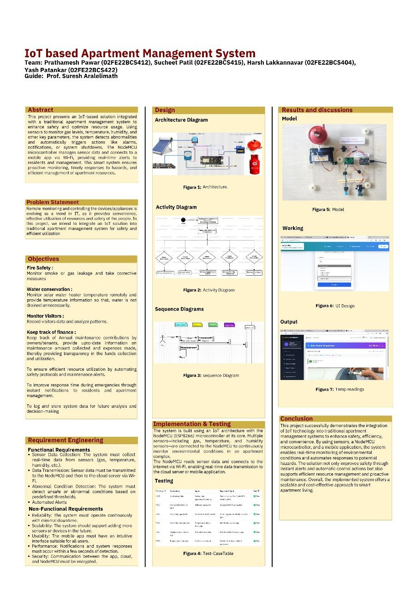
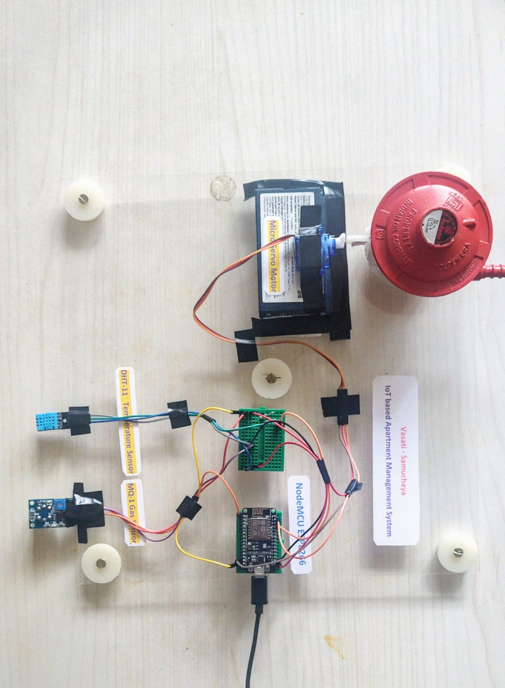

# 💡 IoT-Based Apartment Management System – KLEIoTApp1

A full-stack smart apartment monitoring system developed as a final year project at **KLE Technological University**, combining IoT hardware and a React-based web dashboard for real-time environmental control, alerts, and expense management.

---

## 🚀 Project Highlights

- 🔥 **Fire & Gas Leakage Detection** using MQ sensors  
- 🌡️ **Temperature-Based Fan Control** using DHT11 and servo motor  
- 💧 **Water Conservation Alerts**  
- 🔔 **Send Reminders & Track Expenses**  
- 📊 **Web Dashboard** for real-time sensor data and analytics  

---

## 🧠 Tech Stack

| Layer        | Tech/Tool                         |
|--------------|-----------------------------------|
| IoT Device   | NodeMCU ESP8266, DHT11, MQ-1      |
| Backend      | Python / Arduino IDE              |
| Frontend     | React.js, HTML, CSS               |
| Data Logging | Cloud / CSV / Firebase (optional) |

---

## 🖥️ Screenshots

| Dashboard | Sensors | Graphs |
|----------|---------|--------|
|  |  |  |

---

## 📂 Project Structure

